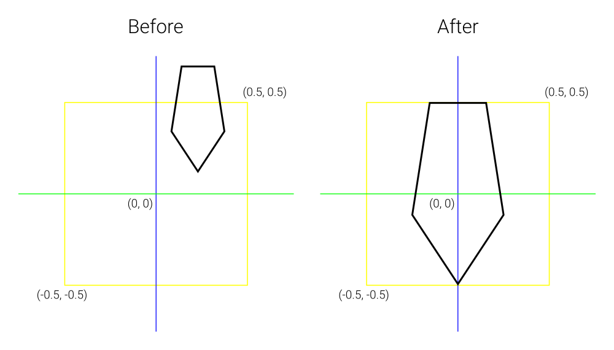
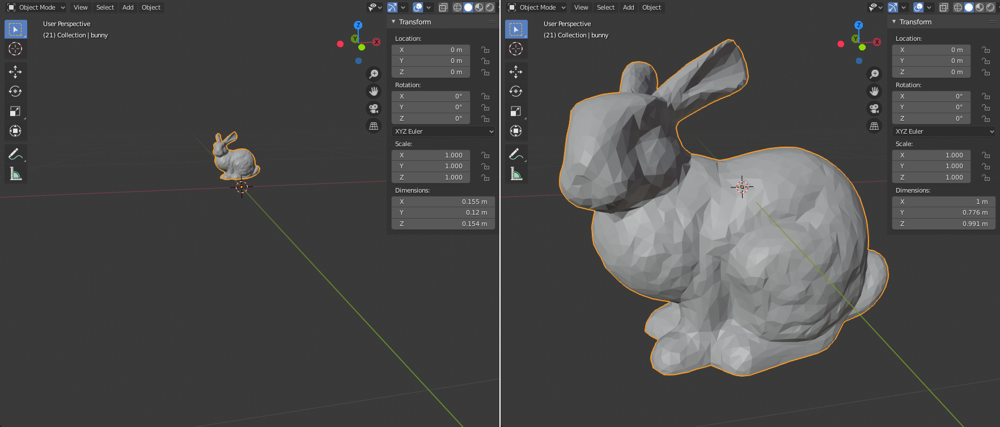

# blender-unitize

A Blender Add-on that proportionally scales and translates the selected mesh to fit exactly in the unit cube around the origin.

## Explanation

This illustrations shows in 2D how a polygon is placed within the origin-centered unit square. The initial polygon has arbitrary dimensions, whereas the resulting polygon has (at least) one dimension that has a size of exactly one. All other dimensions are no larger than one. Note that scaling maintains the mesh's original proportions. The resulting mesh is also centered around the origin.

This 2D illustration (hopefully) clarifies how the resulting mesh in 3D relates to the input mesh.

## Example (3D)

Below, a mesh of the *Stanford Bunny* is shown. Initially it has arbitrary dimensions. After running the script, it fits nicely within the origin-centered unit cube. (Left is before, right is after)

## Installing

These installation instructions are for Blender 2.81, but should be very similar for later versions.

* Open the `Preferences` window (`Edit > Preferences`)
* Select `Add-ons`
* Select `Install...`
* Select the `unitize.py` file from this repository
* Search for the "*Unitize Mesh*" script in the list of installed add-ons
* Check its mark to enable it

## Running

While the script is not integrated into the Blender interface, it can be run as follows:

* Select the mesh to unitize - in *Object mode*
* Press *F3* to open the search menu
* Type "*Unitize Mesh*" and press Enter

As the script ignores model transformations, it is advised to apply all models transformations to the mesh prior to running the script (Ctrl+A, All Transforms).

## License
BSD-3 - See the `LICENSE` file
